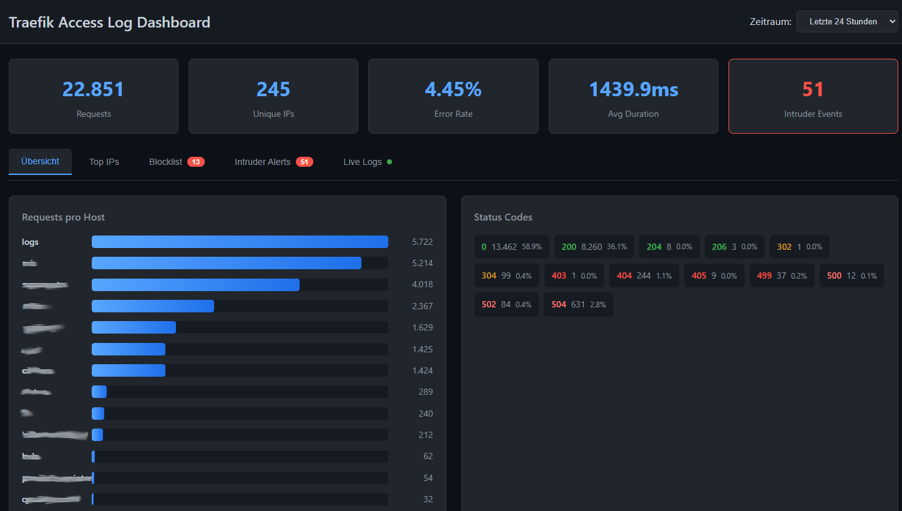
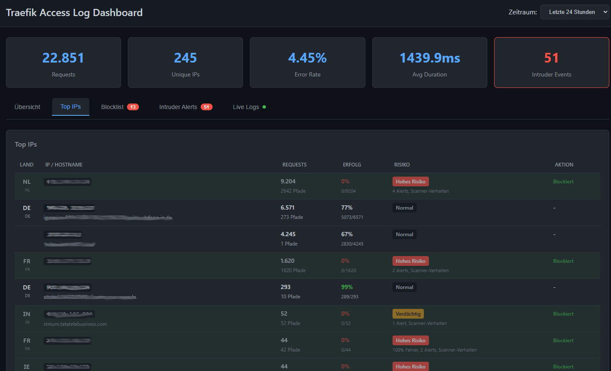
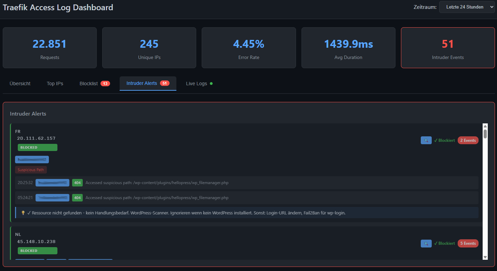
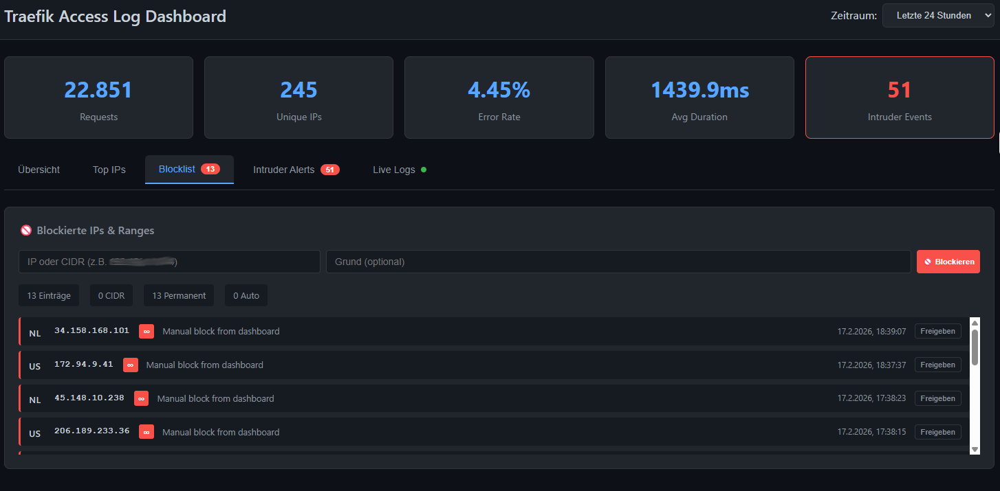
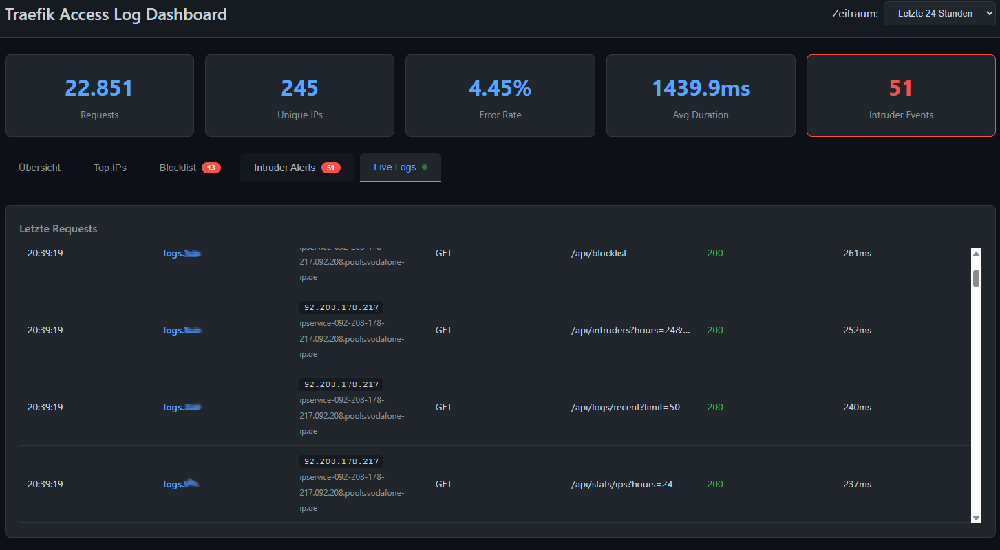

# Traefik Sentinel

A lightweight security dashboard for Traefik access logs with real-time intruder detection, automatic IP blocking, and AbuseIPDB integration.


## Features

- **Real-time Log Monitoring** - Watch Traefik access logs as they happen with live updates
- **Intruder Detection** - Automatic detection of:
  - Rate limit violations
  - SQL injection attempts
  - Suspicious path scanning (wp-admin, .env, phpMyAdmin, etc.)
  - Authentication brute-force attacks
- **Honeypot Paths** - Instant blocking for IPs accessing known malicious paths
- **AbuseIPDB Integration** - Check IP reputation and auto-block known bad actors
- **Auto-Report** - Automatically report blocked IPs to AbuseIPDB to help the community
- **GeoIP Display** - See country flags for all IP addresses
- **Telegram Alerts** - Get instant notifications about security events
- **IP Blocklist** - Manual and automatic blocking with CIDR range support
- **Time-based Blocks** - Configurable block durations based on threat level
- **Log Retention** - Automatic cleanup of old data

## Screenshots

> **Note:** Screenshots show the German UI version. The application is now fully available in English.

### Overview


### Top IPs with GeoIP & Risk Assessment


### Intruder Alerts


### IP Blocklist


### Live Logs


## Quick Start

### 1. Clone the repository

```bash
git clone https://github.com/sprobst76/traefik-sentinel.git
cd traefik-sentinel
```

### 2. Configure

```bash
cp .env.example .env
# Edit .env with your settings
```

**Minimum required:** Set `TRAEFIK_LOG_DIR` to your Traefik access log directory.

### 3. Start

```bash
docker compose up -d
```

### 4. Access

Open `http://localhost:13923` in your browser.

## Configuration

### Environment Variables

| Variable | Default | Description |
|----------|---------|-------------|
| `TRAEFIK_LOG_DIR` | `/var/log/traefik` | Path to Traefik log directory |
| `PORT` | `13923` | Dashboard port |
| `TELEGRAM_BOT_TOKEN` | - | Telegram bot token for alerts |
| `TELEGRAM_CHAT_ID` | - | Telegram chat ID for alerts |
| `ABUSEIPDB_API_KEY` | - | AbuseIPDB API key ([get free key](https://www.abuseipdb.com/account/api)) |
| `ABUSEIPDB_AUTO_REPORT` | `true` | Auto-report blocked IPs to AbuseIPDB |
| `RATE_LIMIT_REQUESTS` | `100` | Max requests per IP per time window |
| `RATE_LIMIT_WINDOW_SECONDS` | `60` | Time window for rate limiting |
| `WHITELISTED_IPS` | - | Comma-separated IPs to never block |
| `HONEYPOT_INSTANT_BLOCK` | `true` | Instantly block honeypot path access |

See `.env.example` for all available options.

### Traefik Configuration

Ensure Traefik is logging in **JSON format**:

```yaml
# traefik.yml
accessLog:
  filePath: /var/log/traefik/access.log
  format: json
```

### Using with Traefik Reverse Proxy

To expose the dashboard through Traefik, uncomment the labels in `docker-compose.yml`:

```yaml
labels:
  - "traefik.enable=true"
  - "traefik.http.routers.sentinel.rule=Host(`sentinel.example.com`)"
  - "traefik.http.routers.sentinel.entrypoints=websecure"
  - "traefik.http.routers.sentinel.tls.certresolver=letsencrypt"
  - "traefik.http.services.sentinel.loadbalancer.server.port=13923"
```

**Important:** Add authentication middleware to protect the dashboard!

## Honeypot Paths

The following paths trigger instant blocking when accessed:

| Category | Examples |
|----------|----------|
| WordPress | `/wp-admin`, `/wp-login.php`, `/xmlrpc.php` |
| Config files | `/.env`, `/.git/config`, `/config.php` |
| Admin tools | `/phpMyAdmin`, `/adminer`, `/phpmyadmin` |
| Shells | `/shell.php`, `/c99.php`, `/webshell` |
| Debug endpoints | `/actuator`, `/debug/pprof`, `/server-status` |

See `app/config.py` for the full list.

## Firewall Integration

Traefik Sentinel exports a blocklist that can be synced to your firewall using ipset.

### Setup ipset

```bash
# Create ipset
ipset create blocklist hash:ip
ipset create blocklist_nets hash:net

# Add iptables rule
iptables -I INPUT -m set --match-set blocklist src -j DROP
iptables -I INPUT -m set --match-set blocklist_nets src -j DROP
```

### Sync via cron

```bash
# /etc/cron.d/traefik-sentinel
* * * * * root /path/to/sync-blocklist.sh
```

Example sync script is provided in `scripts/sync-blocklist-ipset.sh`.

## API Endpoints

| Endpoint | Method | Description |
|----------|--------|-------------|
| `/api/stats` | GET | Overall statistics |
| `/api/stats/ips` | GET | Top IPs with risk assessment and GeoIP |
| `/api/stats/hosts` | GET | Requests per host/subdomain |
| `/api/intruders` | GET | Intruder events grouped by IP |
| `/api/blocklist` | GET | Current blocklist with GeoIP |
| `/api/blocklist` | POST | Block an IP or CIDR range |
| `/api/blocklist/{ip}` | DELETE | Unblock an IP |
| `/api/blocklist/export` | GET | Export blocklist (plain text) |
| `/api/abuseipdb/check/{ip}` | GET | Check IP reputation on AbuseIPDB |
| `/api/abuseipdb/report` | POST | Report IP to AbuseIPDB |
| `/api/retention/stats` | GET | Database statistics |
| `/api/retention/cleanup` | POST | Clean up old log entries |

## Architecture

```
┌─────────────────┐     ┌──────────────┐     ┌─────────────┐
│  Traefik Logs   │────▶│  Log Watcher │────▶│   SQLite    │
│  (access.log)   │     │  (watchdog)  │     │  Database   │
└─────────────────┘     └──────────────┘     └─────────────┘
                               │                    │
                               ▼                    ▼
                        ┌──────────────┐     ┌─────────────┐
                        │   Intruder   │────▶│  Dashboard  │
                        │  Detection   │     │  (FastAPI)  │
                        └──────────────┘     └─────────────┘
                               │                    │
                               ▼                    ▼
┌─────────────────┐     ┌──────────────┐     ┌─────────────┐
│    Telegram     │◀────│   Alerting   │     │  AbuseIPDB  │
│    (Alerts)     │     │              │     │  (Check/    │
└─────────────────┘     └──────────────┘     │   Report)   │
                                             └─────────────┘
```

## Tech Stack

- **Backend**: Python 3.11 + FastAPI
- **Frontend**: HTML + HTMX (lightweight, no build step required)
- **Database**: SQLite
- **Log Watching**: Watchdog
- **GeoIP**: ip-api.com (free, no API key required)

## Contributing

Contributions are welcome! Please feel free to submit a Pull Request.

## License

This project is licensed under the **AGPL-3.0 License** - see the [LICENSE](LICENSE) file for details.

This means:
- ✅ You can use it freely, including commercially
- ✅ You can modify it
- ⚠️ If you modify and distribute it, you must share your changes under AGPL-3.0
- ⚠️ If you run a modified version as a network service, you must make source available

## Acknowledgments

- [Traefik](https://traefik.io/) - The cloud native application proxy
- [AbuseIPDB](https://www.abuseipdb.com/) - IP reputation database
- [ip-api.com](https://ip-api.com/) - Free GeoIP service
- [HTMX](https://htmx.org/) - High power tools for HTML
